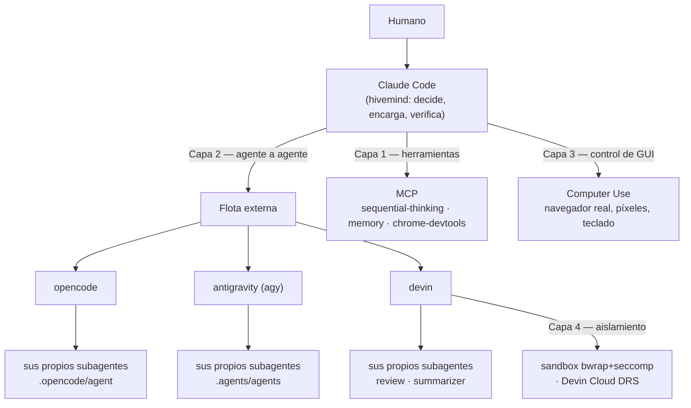

# Hivemind — Claude como corteza de un ecosistema multi-agente

Claude Code es el **hivemind**: entiende la petición, decide quién la ejecuta mejor, redacta el
encargo, y verifica el resultado. No es el único que trabaja, pero sí el único que responde
ante el usuario. Los demás agentes son ejecutores especializados con sus propios modelos, sus
propios subagentes y sus propias herramientas.

La regla que sostiene todo esto: **delegar no es dejar de responder**. Un resultado que Claude
no verificó no es un resultado, es un rumor.

---

## 1. Las cuatro capas del ecosistema agéntico

Un agente moderno opera en cuatro planos. Conviene tenerlos separados porque **cada uno se
rompe distinto** y cada uno decide cosas distintas del enrutado.



### Capa 1 — Herramientas: MCP
El agente llama a una herramienta. Es lo que ya está montado en NEPTUNO (`.mcp.json`) y no
cambia con el hivemind: **cada agente de la flota tiene su propio cliente MCP**, así que un MCP útil
se instala en cada uno — **no se comparte y no se hereda**.

Estado actual (compruébalo, no lo asumas: `devin mcp list`, `agy mcp list`):

| MCP | Claude | devin | agy | opencode |
|---|---|---|---|---|
| `sequential-thinking` | sí | sí | sí | sí (`opencode.json`) |
| `memory` | sí | — | sí | sí |
| `chrome-devtools` | sí | **sí** | — | sí |
| `graphify` | vía CLI | sí (scope `user`) | sí | vía CLI |
| `obsidian-vault` | sí | sí | — | — |

Cómo se añaden (la sintaxis difiere y no es intercambiable):

```bash
devin mcp add <nombre> --scope user -- <comando> [args...]
agy   mcp add [-e K=V] <nombre> <comando> [args...]      # los flags van ANTES del nombre
# opencode: la clave "mcp" de opencode.json, que genera tools/sync-opencode.js
```

**Trampa verificada:** `graphify-mcp` estaba instalado pero **roto** — su venv de pipx no tenía el
paquete `mcp` y moría con `ModuleNotFoundError` nada más arrancar, en silencio, como hace un MCP que
no levanta. Se arregló con `pipx inject graphifyy mcp`. Un MCP configurado no es un MCP que funciona:
pruébalo con un `initialize` por stdin antes de fiarte.

### Capa 2 — Agente a agente: A2A y ACP
Aquí es donde hay que ser preciso, porque el mercado usa dos nombres para dos cosas distintas:

| | **A2A** (Agent2Agent) | **ACP** (Agent Client Protocol) |
|---|---|---|
| Qué resuelve | Un agente descubre y contrata a otro agente **remoto**, de otra organización, negociando capacidades y permisos | Un **cliente** (IDE, orquestador) conduce a un agente **local** por stdio: turnos, permisos de herramienta, streaming |
| Transporte | HTTP + JSON-RPC, con *Agent Card* de descubrimiento | JSON-RPC sobre stdin/stdout del proceso |
| Gobernanza | Donado a la Linux Foundation (Google, Microsoft, AWS y otros) | Impulsado desde el ecosistema de editores/agentes (Zed, y adoptado por varias CLIs) |
| **En esta máquina** | **no implementado por ninguna de las tres CLIs** | **`devin acp` y `opencode acp` lo exponen hoy** (verificado); `agy` no |

Consecuencia operativa: el hivemind de NEPTUNO **no habla A2A**, habla **CLI + ACP**. Los dos
transportes están montados y verificados:

| | **CLI** (`hivemind.js run`) | **Sesión** (`hivemind.js session` / `tools/session.js`) |
|---|---|---|
| Agentes | los tres | **los tres**, por dos protocolos distintos |
| Estado | ninguno: cada encargo arranca en frío | **sesión con turnos**, el agente recuerda |
| Forma | un disparo, un contrato autocontenido | conversación: preguntar, corregir, seguir |
| Permisos | flags de la CLI (`--yolo`, listas blancas) | el cliente responde `session/request_permission` |
| Acceso a disco | el del propio agente | además `fs/read_text_file` / `fs/write_text_file` **a través de nosotros** |
| Coste de arranque | uno por encargo | uno por sesión, se amortiza en varios turnos |

**Antigravity no habla ACP, pero sí tiene sesión.** Su vía es `--input-format stream-json`: NDJSON,
un turno por línea, con la forma `{"event":"user","message":{"role":"user","content":"..."}}`, y
responde con un evento `result` que trae el `conversation_id`. `tools/session.js` unifica los dos
protocolos tras una sola interfaz, pero **no los confunde**: llamar «ACP» a la sesión de antigravity
sería mentir sobre el protocolo, así que el estado de salida dice cuál se usó
(`transporte=acp` / `transporte=stream-json`).

Dos trampas de la CLI de agy, encontradas a base de errores: `--print` **se come siempre el argumento
siguiente**, así que en modo stream hay que pasarlo como `--print=` (valor vacío) y al final; y el
campo del mensaje es `event`, no `type` — con `type` el agente responde `status: ERROR`.

**Cuándo cada uno.** Por defecto, CLI: es universal y un contrato bien escrito no necesita
conversación. Sesión cuando el trabajo sea **iterativo de verdad** — revisar y pedir corrección sobre lo
mismo, encadenar preguntas sobre un análisis caro, o cuando quieras que las lecturas y escrituras
pasen por tu cliente en vez de por el agente.

Medido, dos turnos sobre la misma sesión (`ls | wc -l` → `56`, y después «multiplica por 2 sin volver
a ejecutar» → `112`): devin 10,0 s, antigravity 10,5 s, opencode 23,7 s. Por CLI eso son dos arranques
en frío y el segundo no recuerda el primero.

**Trampa del canal de respuesta**: en un turno de puro razonamiento, sin herramientas, Devin deja el
resultado en `agent_thought_chunk` y cierra el turno sin emitir `agent_message_chunk`. Un cliente que
solo escuche el canal de mensaje **tira la respuesta y reporta vacío** — pasó, y el `112` estaba en el
log. `session.js` guarda el razonamiento aparte y lo usa de respaldo solo si el canal de mensaje quedó
vacío; mezclarlos siempre metería el razonamiento entero en la respuesta.

### Cómo funciona el cliente (`tools/acp.js`)

JSON-RPC 2.0 **delimitado por saltos de línea** sobre stdio — no lleva framing `Content-Length`, y el
`initialize` debe enviarse **de inmediato**: verificado, `devin acp` deja de responder si se envía con
retraso, mientras arranca sus servidores MCP. Handshake: `initialize` (`protocolVersion: 1`) →
`session/new` → `session/prompt`, y las respuestas llegan como notificaciones `session/update` con
trozos `agent_message_chunk`.

Lo que se suele olvidar: **en ACP el cliente también sirve peticiones**. El agente nos llama a
`session/request_permission`, `fs/read_text_file` y `fs/write_text_file`, y si no contestamos se queda
esperando para siempre. Sin humano en el bucle no se puede «preguntar»: el cliente elige una opción
real de las que ofrece el agente (`allow_always`, o `reject_*` con `--safe`).

**`--safe` no es un sandbox, y hay que decirlo claro.** Solo gobierna lo que responde *nuestro*
cliente. Verificado: `opencode` ejecuta sus herramientas emitiendo `tool_call` **sin pedir permiso
jamás**, así que `--safe` no le impide nada — el cliente lo avisa explícitamente cuando termina sin
haber denegado nada. Sí bloquea las escrituras que pasen por `fs/write_text_file` (comprobado con la
prueba inversa: sin `--safe` el archivo se crea, con `--safe` no). Para aislamiento real sigue siendo
`devin --sandbox` por la vía CLI.

### Capa 3 — Control de GUI: Computer Use
Cuando no hay API y solo hay pantalla. En NEPTUNO lo cubre el MCP `chrome-devtools` (navegar,
click, rellenar, captura, consola, red) y la skill `claude-in-chrome`.

Aquí hay que corregir una creencia cómoda: **la flota sí controla navegadores**. Verificado leyendo el
catálogo que el propio agente publica (`node tools/session.js capabilities antigravity`):

- **antigravity expone 57 herramientas nativas**, entre ellas `browser_click_element`,
  `browser_get_dom`, `browser_input`, `browser_press_key`, `capture_browser_screenshot`,
  `execute_browser_javascript`, `browser_list_network_requests` y un `browser_subagent` dedicado.
  Es control de GUI de primera clase, no un MCP añadido.
- **devin** llega al navegador por el MCP `chrome-devtools` que tiene configurado.

La capacidad no la da la CLI en abstracto, la da su catálogo real — y eso **se comprueba, no se
supone** (`session.js capabilities <agente>`, `devin mcp list`, `agy mcp list`).

Consecuencia para el enrutado: **una tarea de navegador ya se puede delegar a antigravity**, que
además es el más barato. Lo que no cambia es quién firma: **la verificación visual final no se
delega**. Si el criterio es "el login funciona de verdad en el navegador", lo miras tú. Delegar la comprobación a quien hizo el trabajo es el
antipatrón que este documento entero existe para evitar.

### Capa 4 — Ejecución aislada: harnesses y sandboxes
Escribir código no es entregarlo. El agente levanta el entorno, instala, ejecuta las pruebas, lee
los logs y se corrige antes de que nadie vea el resultado. Lo que hay instalado:

| Agente | Aislamiento disponible |
|---|---|
| `devin` | `--sandbox` (bwrap + seccomp en Linux) y **Devin Cloud DRS**: entornos declarativos y sesiones sandbox remotas |
| `agy` | `--sandbox` (restricciones de terminal) |
| `opencode` | permisos por herramienta en la config del agente; sin sandbox de proceso |
| Claude Code | permisos del harness + el sandbox de Bash de la sesión |

**Regla:** todo encargo que ejecute comandos destructivos, instale dependencias o toque red va con
sandbox, y va a quien lo tenga de verdad (Devin primero).

### Cómo se mide — y cómo eso decide el enrutado
Los benchmarks de agencia no son marketing: son la descripción más precisa que existe de **qué
forma de tarea** mide cada cosa. Úsalos como rúbrica de reparto, no como ranking.

| Benchmark | Qué mide | Qué implica al repartir |
|---|---|---|
| **SWE-bench (Pro/Max)** | resolver issues reales tocando **muchos archivos** de un repo grande | tarea de repo amplio → agente con contexto grande y buen seguimiento de plan |
| **TAU2-bench** | llamar a las **APIs correctas en el orden correcto** sin inventar parámetros | tarea de integración/herramientas → agente disciplinado, no el más creativo |
| **OSWorld** | operar un SO completo por clics | ninguna CLI de la flota compite aquí → capa 3, se queda en casa |

---

## 2. La flota

Estado en vivo: `node tools/hivemind.js doctor`. Enrutado resumido: `node tools/hivemind.js roster`.

## El interruptor: trabajar solo con Claude

```bash
hivemind off      # modo solo Claude
hivemind on       # vuelve a haber flota
hivemind status   # cuál de los dos, y de dónde sale el estado
```

`hivemind` es el atajo de `tools/bin/hivemind`, copiado a `~/.local/bin/` para no depender del
directorio en el que estés. La forma larga —`node tools/hivemind.js off`— hace exactamente lo
mismo y funciona con ruta absoluta desde cualquier sitio.

Apagada, `run` y `session` **no llaman a ninguna CLI externa**: salen con código 3 y un mensaje.
Es un bloqueo, no una advertencia — la decisión de no delegar no debe depender de que el modelo se
acuerde.

Y para que no dependa de eso, el hook `hivemind-toggle` se lo dice a Claude al abrir sesión. Sin
él, el aviso llega tarde: habría planificado el reparto y redactado los encargos antes de chocar
con el error. Cuando la flota está encendida el hook calla, porque §9 de `CLAUDE.md` ya lo dice y
repetirlo solo gasta contexto.

El estado vive en `~/.neptuno/hivemind.json`, fuera del repo: vale para todos los proyectos y
ningún `sync-*.js` lo puede pisar. Sin fichero, la flota está disponible — apagarla es una decisión
explícita, nunca el valor por defecto.

Para una sola invocación, sin tocar el estado guardado, manda la variable de entorno:

```bash
NEPTUNO_HIVEMIND=0 node tools/hivemind.js run opencode "…"   # rechazado; el estado sigue igual
```

### opencode
- **Qué es**: CLI agéntica de código abierto, multi-proveedor. Elige el modelo por invocación.
- **Contexto que lee**: `AGENTS.md` (= nuestro `CLAUDE.md`, nativamente), `.opencode/command/`
  (las 56 skills), `.opencode/agent/` (los 14 agentes NEPTUNO ya portados).
- **Subagentes propios**: sí — los 14 de NEPTUNO, ya generados por `tools/sync-opencode.js`.
  Un encargo a opencode puede decirle "usa tu subagente `critic`" y lo tiene.
- **Fuerte en**: refactors multi-archivo largos; tareas donde interesa fijar un proveedor concreto;
  reutilizar la doctrina NEPTUNO sin traducción (es el único que ya la tiene entera).
- **Débil en**: sin navegador ni visión; muy verboso; y **se cuelga en silencio si no hay
  credenciales** en vez de fallar rápido.
- **Coste**: el del proveedor que le fijes. **En esta cuenta la credencial es OpenCode Zen**, cuyos
  IDs llevan prefijo `opencode/`, no `anthropic/` — un agente fijado a `anthropic/...` no resuelve.
  Y los modelos de pago de Zen devuelven `Insufficient balance` mientras el workspace no tenga saldo:
  por eso los 14 agentes se generan hoy con `--provider=zen-free`. Cuando haya saldo, regenera con
  `node tools/sync-opencode.js --provider=zen` y recupera Claude Sonnet/Opus.

### antigravity (`agy`)
- **Qué es**: CLI del ecosistema Antigravity de Google. Multi-modelo: Gemini 3.7 Flash / 3.1 Pro,
  Claude Sonnet 4.6 y Opus 4.6, GPT-OSS 120B.
- **Contexto que lee**: `AGENTS.md` y el árbol `.agents/` (`skills/`, `agents/`, `rules/`,
  `workflows/`, `hooks/`, `plugins/`).
- **Subagentes propios**: sí, y de los más completos de la flota: `define_subagent`,
  `invoke_subagent`, `manage_subagents` y un `browser_subagent` especializado, además de `--agent`
  y `.agents/agents/`. Puede **definir subagentes nuevos en caliente**, no solo invocar los que ya
  tiene.
- **Fuerte en**: exploración de repos desconocidos y contexto muy grande; multimodal; **barato y
  rápido** en Flash — es el agente al que mandas el trabajo de volumen. Tiene `--effort` para subir
  el razonamiento solo cuando hace falta, y `--output-format stream-json` + `--json-schema` para
  salida estructurada verificable.
- **Débil en**: menos disciplinado con protocolos largos; con Flash conviene dar criterios de salida
  explícitos y verificables o rellena. No tiene ACP.
- **Coste**: el más bajo de los tres en Flash.

### devin
- **Qué es**: CLI de Cognition, con presencia local y en la nube.
- **Contexto que lee**: **`.claude/skills/` y `~/.claude/skills/` nativamente** (lee las skills de
  NEPTUNO sin traducir ni sincronizar nada), más `.agents/skills/`, `.cognition/skills/`, y reglas
  desde `.windsurf/rules/*.md` (always-on) y `.cursor/rules/*.md`.
- **Subagentes propios**: sí — agentes tipados (`review`, `summarizer`) expuestos incluso por ACP.
- **Fuerte en**: **trabajo autónomo de larga duración**; es el único con sandbox de proceso serio
  (bwrap+seccomp) y con entornos remotos declarativos (`devin cloud drs`). Para "arréglalo y no me
  cuentes los pasos", es este.
- **Débil en**: requiere login y consume créditos; el arranque en frío es caro para tareas pequeñas;
  su autonomía es un riesgo si el encargo está mal acotado.
- **Coste**: el más alto. No lo uses para lo que resuelve Flash.

---

## 3. Tabla de enrutado

Enruta por **forma de la tarea**, no por prestigio del modelo.

| Forma de la tarea | A quién | Por qué |
|---|---|---|
| Decisión de diseño, trade-offs, arquitectura | **Claude** (`architect`) | Es la corteza; no se delega el criterio |
| Verificación de que algo funciona de verdad | **Claude** (`verifier`) | Quien encarga no puede subcontratar la comprobación |
| Cualquier cosa con navegador o pantalla | **Claude** (chrome-devtools) | Capa 3: la flota no la tiene |
| Barrido amplio de un repo desconocido, inventario, "¿dónde está X?" | **antigravity** (Flash) | Contexto grande, barato, rápido |
| Volumen: N archivos con la misma transformación mecánica | **antigravity** | Lo caro aquí es el tamaño, no el razonamiento |
| Extraer datos estructurados de mucho texto/código | **antigravity** (`--json-schema`) | Salida validable por esquema |
| Refactor multi-archivo con plan ya cerrado | **opencode** | Tiene la doctrina y los 14 agentes NEPTUNO |
| Tarea larga y autónoma con tests que deben quedar en verde | **devin** | Sandbox real + itera solo hasta cerrar |
| Algo que toca red, instala dependencias o puede romper la máquina | **devin** `--sandbox` | Es el único aislamiento de proceso de verdad |
| Tarea de 5 minutos | **nadie: hazla tú** | El arranque en frío de un agente externo cuesta más que la tarea |

**Reparto en paralelo**: si la tarea se divide en trozos independientes, despacha a varios a la vez
(`/parallel-split`) y **quédate con el trabajo de integrar y verificar**. Nunca repartas trozos que
se pisan los mismos archivos.

---

## 4. Protocolo de despacho

Un agente externo no comparte tu contexto: **arranca en frío**. Todo lo que no esté en el encargo,
no existe. El encargo lleva siempre estas seis cosas:

```
1. OBJETIVO       una frase verificable
2. CONTEXTO       rutas concretas, versiones, convención a imitar; nada de "ya sabes"
3. ALCANCE        qué archivos puede tocar — y explícitamente cuáles NO
4. CRITERIO DE SALIDA   cómo sabemos que terminó: comando que debe pasar, salida esperada
5. FORMATO        qué devuelve (diff, informe, JSON con esquema)
6. AUTONOMÍA      si puede usar sus propios subagentes y cuáles (dilo: por defecto se cohíben)
```

**El CRITERIO DE SALIDA debe ser un comando ejecutable, no una descripción en prosa.** Es la
diferencia medida entre acertar y fallar, no una preferencia de estilo:

| Encargo | Devin | opencode |
|---|---|---|
| «cuenta los SKILL.md bajo `.agents/skills/`» (prosa) | **15 — mal**, contó el directorio hermano `.agents/agents/`, en 12,8 s | 56 — bien, en 54,6 s |
| «ejecuta `find .agents/skills -name SKILL.md \| wc -l` y reporta su salida» | **56 — bien, en 4,2 s** | — |

El mismo agente, la misma pregunta: falla cuando puede responder por inferencia y acierta cuando el
encargo lo obliga a ejecutar. Si no puedes escribir el criterio de salida como un comando, el encargo
todavía no está listo para delegarse.

Y estas tres reglas:

- **Prohibido delegar el criterio.** Se delega ejecución acotada. "Decide tú la arquitectura" a un
  agente externo es abdicar, no orquestar.
- **Verifica siempre el resultado tú mismo.** Lee el diff, ejecuta los tests. Un agente que reporta
  éxito no es evidencia de éxito. Esto no es desconfianza: es que **tú** respondes ante el usuario.
- **Y cuando haga falta, intervén.** Delegar no termina en aceptar o rechazar: lo normal es recibir
  trabajo casi bueno y **acabarlo tú**. Ver §4 bis.
- **La salida no entra en tu contexto.** `tools/hivemind.js` escribe el log completo a
  `.hivemind/runs/` y solo devuelve la cola. Si necesitas el detalle, lee el archivo con `sed -n`
  sobre el tramo que importa. Volcar 5.000 líneas de log al contexto anula la razón de delegar.

### Invocación

```bash
node tools/hivemind.js doctor                       # quién está vivo y autenticado
node tools/hivemind.js roster                       # enrutado resumido
node tools/hivemind.js run antigravity "<encargo>" --timeout 600
node tools/hivemind.js run devin --prompt-file encargo.md --yolo --timeout 1800
node tools/hivemind.js run opencode "<encargo>" --model opencode/nemotron-3.5-lightning-free

# Sesión con turnos (solo devin y opencode)
node tools/hivemind.js acp opencode "<mensaje>" --turno "<seguimiento>" --turno "<otro>"
node tools/hivemind.js acp capabilities devin
```

Para no quemar contexto con el log, despacha desde el agente `delegate` (Sonnet), igual que
`android`/`desktop` existen para no comerse el output de Gradle.

### La trampa del directorio: el agente no trabaja donde crees

**Antigravity ejecuta sus comandos de terminal en su propio scratch**
(`~/.gemini/antigravity-cli/brain/<uuid>`), no en el directorio del encargo. Una ruta relativa no
falla ruidosamente: `ls .agents/skills` no encuentra nada, `wc -l` devuelve **`0`**, y el agente
entrega ese `0` como si fuera la respuesta. Es el peor tipo de fallo — uno que parece un resultado.

Se descubrió pidiéndole que imprimiera su propio `pwd`. El despachador lo corrige solo: antepone al
prompt el directorio absoluto con la instrucción de hacer `cd` antes de cualquier ruta relativa, y
pasa el cwd como `--add-dir`. Verificado: el mismo encargo pasó de `0` a `56`.

**Lección general**: cuando un agente externo devuelva un cero, un vacío o una lista corta, la primera
hipótesis no es «no hay nada», es **«está mirando en otro sitio»**. Y por eso el criterio de salida se
escribe con rutas absolutas siempre que puedas.

### La trampa del proveedor: autenticado ≠ puede ejecutar

`doctor` responde «¿tiene credenciales?», no «¿puede ejecutar este modelo?». Son preguntas
distintas y las dos fallan de forma distinta:

| Síntoma | Causa | Arreglo |
|---|---|---|
| `Insufficient balance` | credencial válida, workspace sin saldo | usa un modelo `*-free`, o recarga |
| el modelo «no existe» | el ID lleva el prefijo del proveedor equivocado (`anthropic/` vs `opencode/`) | regenera con `--provider=` correcto |
| `Eligibility check failed: dial tcp … server misbehaving` | DNS/red, no el agente | reintenta; no es un fallo del encargo |

Ninguno de los tres se detecta antes de despachar. Por eso el primer encargo a un agente recién
configurado debe ser **trivial y verificable** — contar archivos, ejecutar un `ls` — antes de
confiarle trabajo real.

### El tope de tiempo tiene que matar, no pedir por favor

`agy` ignoró un `SIGTERM` y siguió **2.889 s con `--timeout 260`**: 48 minutos de un despacho que
debía morir a los 4. `tools/hivemind.js` usa ahora `killSignal: 'SIGKILL'` y trata un `SIGKILL` como
timeout. Verificado: un encargo con `--timeout 15` muere exactamente a los 15 s.

Si escribes tu propio despachador, no heredes este bug: un agente colgado sin tope duro bloquea la
sesión entera y no hay nada en su salida que te avise.

El reverso: **`opencode run` puede dar la respuesta correcta y luego no salir**, así que el
despachador distingue `timeout-con-salida` de `timeout` a secas — en el primero el trabajo está hecho
y descartarlo sería tirar una respuesta válida.

Pero ese cuelgue tenía **dos causas reales, y ninguna era «opencode es lento»**:

1. **Sin `--auto`, opencode pide permiso y espera para siempre.** En un pseudo-terminal sin humano
   detrás, una petición de permiso no se responde nunca. El despachador pasa `--auto` salvo `--safe`.
2. **`nemotron-3-ultra-free` está saturado**: >117 s sin responder al mismo encargo que
   `nemotron-3.5-lightning-free` y `ling-3.0-flash-fin-free` contestan **en 8 s con `exit=0`**. El
   gratuito «más potente» es aquí el menos utilizable. Por eso `--provider=zen-free` usa los rápidos
   y el despachador fija `opencode/nemotron-3.5-lightning-free` cuando no le das `--model`.

Con las dos cosas puestas, opencode responde en **10 s** el mismo encargo que antes se colgaba.
Y hay un tercer detalle: opencode mira si stdout es un TTY — sin pseudo-terminal bloquea la salida en
buffer, así que el despachador lo lanza bajo `script`, con el prompt en un archivo (nunca interpolado
en la línea de shell, para que unas comillas en el encargo no se conviertan en comandos).

### La trampa del snap: autenticación que existe pero no se ve

Si lanzas la flota desde un terminal que vive dentro de un snap (el de VS Code, por ejemplo), ese
entorno exporta `XDG_DATA_HOME=~/snap/<app>/<rev>/.local/share`. Las CLIs buscan ahí sus credenciales,
no las encuentran, y reportan **«not logged in» aunque el `auth.json` exista** en `~/.local/share`.
Afecta a `opencode`, a `devin` y también a `pipx` (que "pierde" venvs perfectamente instalados).

`tools/hivemind.js` lo corrige solo: detecta las variables `XDG_*` que apuntan a un snap, las
reescribe antes de lanzar nada — sondas incluidas — y lo avisa en `doctor`. Si trabajas a mano desde
esa clase de terminal, exporta `XDG_DATA_HOME=$HOME/.local/share` antes de invocar nada de la flota.

### La trampa de los permisos en modo headless

Un agente sin terminal interactivo **no puede pedirte permiso**. Si el encargo necesita leer un
archivo o ejecutar un comando y no le diste permiso por adelantado, la CLI **auto-deniega, no hace
nada y sale con código 0** — es decir, un encargo fallido con toda la pinta de haber salido bien.
Verificado con `agy`: sin `--yolo`, un encargo que solo listaba un directorio devolvió cero trabajo
y `exit=0`.

Por eso `tools/hivemind.js` no se fía del código de salida y clasifica el resultado:

| `HIVEMIND_STATUS` | Qué pasó | Qué hacer |
|---|---|---|
| `ok` | terminó y produjo salida | verifícala igualmente |
| `permisos` | auto-denegó una herramienta | repite con `--yolo`, o acota el encargo a algo sin herramientas |
| `sin-salida` | terminó sin producir nada | el encargo no dice qué devolver: reescríbelo |
| `timeout` | superó `--timeout` sin producir nada | sube el tope o parte la tarea |
| `timeout-con-salida` | respondió pero **no terminó el proceso** | el trabajo está en el log: léelo antes de reintentar |
| `error` | la CLI falló | lee el log |

**Regla:** un encargo que escriba, instale o toque red va con `--yolo`. Y como `--yolo` auto-aprueba
**todo**, ese es justamente el encargo que debe llevar el ALCANCE más estrecho y, si de verdad toca
red o instala cosas, irse a Devin con sandbox.

Para los encargos de solo lectura hay una salida mejor que `--yolo`: **una lista blanca**. En
`~/.gemini/antigravity-cli/settings.json` (`permissions.allow`) están permitidos los ~30 comandos de
lectura que usa una exploración normal (`ls`, `cat`, `find`, `grep`, `git status`, `graphify query`…),
así que un encargo de barrido corre sin auto-aprobar nada peligroso. Verificado: un encargo con `ls`
completó sin `--yolo`. Amplía esa lista antes de recurrir a `--yolo`.

**Las herramientas MCP viven en otro espacio de permisos**: se aprueban con `mcp(<servidor>)`, no con
`command(...)`. Con la lista de comandos ya puesta, `agy` seguía auto-denegando en cuanto el encargo
tocaba un MCP. Están añadidas las reglas `mcp(graphify)`, `mcp(sequential-thinking)` y `mcp(memory)`.

---

## 4 bis. Intervenir: el trabajo del jefe no acaba en el encargo

Un jefe que solo reparte y puntúa no es un jefe, es un buzón. **La opción por defecto al recibir
trabajo delegado no es aceptarlo ni rechazarlo: es cogerlo y acabarlo.** Un agente externo entrega
casi siempre algo entre el 60% y el 90% de lo que hace falta; ese resto lo pones tú, y es donde está
la diferencia entre un resultado y un entregable.

### Las cuatro salidas, en orden de frecuencia real

| Salida | Cuándo | Coste |
|---|---|---|
| **Intervenir** ← *el caso normal* | la estructura es correcta, fallan detalles: un caso borde, una convención del repo, un test flojo, un nombre malo | bajo: conservas todo lo bueno |
| **Aceptar tal cual** | pasa el criterio y el diff no tiene nada que corregir. Raro, y sospechoso si es frecuente | ninguno |
| **Reencargar** | el encargo estaba mal escrito (criterio ambiguo, contexto ausente) **y** el trabajo es inservible | alto: arranca en frío otra vez |
| **Descartar y hacerlo tú** | el enfoque es equivocado de raíz, no los detalles | el de hacerlo entero |

**Reencargar es casi siempre el peor negocio.** Reinicia en frío, tira el 80% aprovechable y suele
producir otra variante del mismo fallo. Si te sorprendes reencargando, pregúntate si lo que querías
era intervenir.

### Qué falla en el trabajo delegado (y por tanto qué revisar)

Los defectos son predecibles porque nacen todos de lo mismo: el agente **no tiene tu contexto**.

1. **Convenciones del repo ignoradas.** Nombra, estructura o maneja errores a su manera y no a la de
   los archivos vecinos. Es el defecto nº 1 y casi nunca lo detecta un test.
2. **APIs plausibles pero inexistentes**, o firmas de una versión distinta de la que hay instalada.
3. **Tests que pasan sin probar nada** — afirman sobre la implementación, o no fallarían si rompes el
   código. Prueba la mutación: rompe una línea a mano y mira si el test se entera.
4. **Alcance desbordado**: tocó archivos que no le tocaban. Revierte esa parte antes de mirar nada más.
5. **Casos borde ausentes**: el camino feliz funciona; el vacío, el nulo y el error de red, no.
6. **Comentarios que narran** (`// ahora llamamos a X`) en vez de explicar restricciones.
7. **Prosa de modelo** en documentación y mensajes de commit → pásale `write-natural`.

### Cómo intervenir sin estropearlo

- **Primero lee entero, luego edita.** Entender por qué lo hizo así evita "arreglar" algo correcto.
- **Conserva lo que funciona.** No reescribas por gusto estético: tu diff sobre el suyo debe ser el
  mínimo que lo lleva al estándar.
- **Arregla la causa, no el síntoma.** Si el agente ignoró una convención en 6 sitios, arréglala en
  los 6, no en el que te saltó a la vista.
- **Vuelve a ejecutar el criterio de salida después de tocar.** Tu intervención también puede romper.
- **Di lo que hiciste encima.** El usuario tiene derecho a saber qué escribió el agente y qué
  corregiste tú. Sin eso, delegar se vuelve opaco.

### Y a veces la intervención es la parte difícil

Cuando repartes en paralelo, cada agente hace un trozo y **nadie hace la integración**: las fronteras
entre trozos, las decisiones que afectan a dos, la coherencia del conjunto. Eso no se delega — es
tuyo, y suele ser lo que más piensa de todo el trabajo.

## 4 ter. Verlo: la interfaz

Repartir trabajo entre subagentes y flota crea un problema nuevo: **saber quién está parado**.
`pixel-agents --port 3100` lo resuelve mostrando cada sesión de Claude Code y cada subagente como un
personaje en una oficina, con bocadillo cuando alguien está bloqueado esperándote.

**La flota externa también sale**, aunque Pixel Agents solo implemente el proveedor de Claude Code:
`tools/pixel-bridge.js` emite los mismos eventos de hook por cada agente externo, con su propio
`session_id`, contra la misma API que usa el hook oficial. Sin forkear nada. Cada uno sale con su
nombre (`opencode`, `antigravity`, `devin`) y sigue tecleando mientras dura el encargo, gracias a un
latido que evita que el servidor lo marque ocioso a los 5 s. Un despacho que falla levanta bocadillo
(`idle_prompt`) en vez de irse callado, que es justo cuando quieres mirar.

**Requiere un paso previo, una sola vez**, y antes de arrancar el servidor:

```bash
node tools/pixel-bridge.js preparar    # enciende "Watch All Sessions"
```

Sin él el servidor responde `200 ok` a cada evento y **no aparece nadie**: descarta toda sesión
externa cuyo proyecto no tenga ya un personaje, que es siempre el caso de un agente que arranca en
frío. Ese `200` es lo que hace que el fallo parezca un éxito, y es exactamente el tipo de trampa
contra la que sirve la regla de verificar contra el sistema real y no contra un doble propio.

Funciona en los dos transportes, y `doctor` dice si hay servidor escuchando. Detalle, mapeo de
eventos, las tres condiciones no obvias del protocolo y cómo comprobarlo por WebSocket, en
`docs/PIXEL-AGENTS.md`.

## 5. Interoperabilidad: una doctrina, cuatro lectores

NEPTUNO tiene **una sola fuente de verdad** (`.claude/`) y capas generadas para cada dialecto:

| Destino | Lee | Se genera con |
|---|---|---|
| Claude Code | `.claude/skills/`, `.claude/agents/`, `CLAUDE.md` | (fuente) |
| Claude global | `~/.claude/` | `node tools/sync-global.js` |
| opencode | `.opencode/command/`, `.opencode/agent/`, `AGENTS.md` | `node tools/sync-opencode.js` |
| devin | `.claude/skills/` **nativo**, `.agents/skills/`, `.windsurf/rules/` | `node tools/sync-agents.js` |
| antigravity | `AGENTS.md`, `.agents/{skills,agents,rules}` | `node tools/sync-agents.js` |

`.agents/` es el terreno común: **Devin y Antigravity lo leen los dos**. Por eso el puente hacia la
flota es un solo script y no dos.

Tras editar cualquier cosa en `.claude/`, resincroniza las cuatro capas:

```bash
node tools/sync-global.js && node tools/sync-opencode.js && node tools/sync-agents.js
```

---

## 6. Límites honestos

Lo que **está verificado ejecutándolo** en esta máquina:

- **Sesión con memoria en los TRES agentes** (`tools/session.js`), por dos protocolos: ACP en devin
  y opencode, stream-json en antigravity. Mismo encargo de dos turnos (`56` → `112`) correcto en los
  tres: devin 10,0 s, antigravity 10,5 s, opencode 23,7 s.
- **antigravity publica 57 herramientas nativas con control de navegador completo y 4 herramientas
  de subagentes**, comprobado con `session.js capabilities`.
- **ACP montado y funcionando**: handshake, sesión, multi-turno con memoria,
  permisos y `fs/*` servidos por el cliente. `opencode` PONG en 4,3 s. Errores cubiertos: agente desconocido sale con 2 en vez de
  volcar una traza, y el tope de tiempo mata (13 s con tope 12).
- **Los tres reciben órdenes de Claude y las ejecutan correctamente.** Misma orden, misma verdad
  (`56`): opencode `ok` en 10 s, antigravity `ok` en 6 s, devin `ok` en 5 s. Antes de los arreglos de
  esta tabla, opencode se colgaba indefinidamente y antigravity contestaba `0` sin error visible.
- **Los tres reciben órdenes de Claude y las ejecutan.** Mismo encargo despachado con
  `tools/hivemind.js run`, leyendo el repo por el puente `.agents/`: antigravity 56 correcto en
  19,8 s; opencode 56 correcto en 54,6 s (lo verificó con su propio `find`); devin 56 correcto en
  4,2 s **al segundo intento**, con criterio de salida ejecutable.
- **La flota aparece en la oficina de Pixel Agents, cada uno con su nombre y trabajando.** Despacho
  simultáneo de los tres, estado leído por WebSocket contra el servidor real (no contra un doble):
  `#7 antigravity`, `#8 opencode`, `#9 devin`, los tres `active` a la vez y con el encargo a la
  vista, cada uno desapareciendo al terminar (antigravity 15,8 s, devin 12,5 s, opencode 42,9 s).
  El servidor lo confirma en claro: `Hook: Agent N - detected hooks-only external session`.
- **Pixel Agents no manda nada fuera de la máquina.** Con el servidor arriba y tras despachar:
  escucha solo en `127.0.0.1:3100`, cero conexiones remotas, cero transcripts abiertos en ese
  instante. Método y comando para repetirlo en `docs/PIXEL-AGENTS.md`.
- **El entorno de un terminal dentro de un snap rompe la autenticación de la flota.** VS Code exporta
  `XDG_DATA_HOME=~/snap/code/<rev>/.local/share`, así que las CLIs buscan sus credenciales dentro del
  sandbox y reportan «not logged in» aunque el `auth.json` exista en `~/.local/share`. `hivemind.js`
  detecta las variables XDG que apuntan a un snap y las reescribe antes de lanzar nada — sondas
  incluidas — y lo avisa en `doctor`. Sin esto, `doctor` daba 1/3 con los tres autenticados.
- `devin` ve las skills de NEPTUNO por **tres** rutas a la vez (`.claude/skills/`, `~/.claude/skills/`
  y `.agents/skills/`) — las lista duplicadas, que es ruido cosmético, no un fallo.
- La regla always-on llega a Devin: `devin rules list` muestra `neptuno [Windsurf] always-on` y
  `AGENTS [Standard] always-on`. Necesitó `trigger: always_on` en el frontmatter; sin él quedaba
  registrada como `manual` y no se inyectaba nunca.
- `devin acp` y `opencode acp` existen como servidores ACP.
- `tools/hivemind.js doctor` distingue instalado de autenticado en los tres, y `run` distingue
  `ok` de `permisos` / `sin-salida` / `timeout`.

Lo que **no está verificado**:

- Los sandboxes (`--sandbox` de devin y agy) no se han ejercitado.
- **Devin acierta por inferencia solo a veces** (ver la tabla del §4): trátalo como un ejecutor al
  que hay que pinchar con comandos, no como un oráculo. Una sola muestra por agente no es una
  medida: no extrapoles estos tiempos ni estos aciertos a tareas grandes.

No presentes ninguna de estas rutas como probada hasta que lo esté. Cuando una se pruebe, mueve la
línea de esta sección a la de arriba: **esta sección es el registro de deuda de verificación del
hivemind**, y vaciarla es parte del trabajo.
